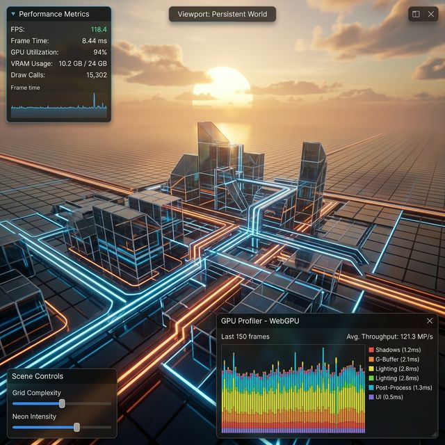

# 🌌 Null Graph Engine `v3.0`

**Null Graph Engine** is a state-of-the-art, high-performance 3D graphics library and interactive scene editor built exclusively for the **WebGPU** era. Designed for scalability and visual excellence, it bridges the gap between raw hardware power and developer productivity.



## 💎 Core Pillars

### ⚡ Next-Gen Performance
*   **WebGPU-First**: Leveraging the full power of the latest GPU API for low-overhead, multi-threaded rendering.
*   **Data-Oriented ECS**: Built on a high-performance Entity Component System (ECS) for managing thousands of objects with ease.
*   **Job System Architecture**: Efficient CPU task distribution to keep the frame rate stable under heavy loads.
*   **Intelligent Batching**: Transparent instance batching to reduce draw calls and maximize throughput.

### 🎨 Visual Fidelity
*   **Advanced Deferred Shading**: A 5+ channel G-Buffer supporting complex lighting scenarios with thousands of dynamic point and directional lights.
*   **Compute-Driven Post-Processing**: High-fidelity effects powered by GPU Compute shaders (HDR, Tone Mapping, SSAO, SSA).
*   **Infinite Procedural Ground**: Anti-aliased, distance-faded spatial reference grid for professional-grade editing.
*   **Dynamic LOD System**: Automated Level of Detail scaling for massive 3D environments.

### 🧩 Developer Workflow
*   **Render Graph Abstraction**: Automatic resource lifecycle management, dependency tracking, and memory reuse.
*   **Robust Asset Pipeline**: Native support for **glTF/GLB** and **OBJ** with a high-speed binary parser.
*   **Glassmorphism Scene Editor**: A premium, responsive dark-mode HUD with real-time transform synchronization.
*   **Custom GPU Profiler**: Real-time breakdown of GPU timings and CPU/GPU memory usage.

---

## 🏗️ Technical Architecture

The engine is built around a **Render Graph** system that manages the entire frame lifecycle:

| Phase | Description |
| :--- | :--- |
| **Geometry Pass** | Populates the G-Buffer (Albedo, Normal, MetalRough, Velocity, Depth). |
| **Compute Jobs** | GPU compute tasks for physics, spatial acceleration, or logic. |
| **Grid Pass** | Procedural overlay integrated directly into the depth-tested geometry pass. |
| **Lighting Pass** | High-performance deferred lighting with HDR and multi-channel synchronization. |
| **Blit & Post** | Screen-space tone mapping and final framebuffer output. |

---

## 🚀 Getting Started

### Installation
```bash
# Clone and install dependencies
git clone https://github.com/Aniket9rana/Null-Graph-Engine.git
cd null-graph-engine
npm install
```

### Development
```bash
# Launch the interactive editor with Vite
npm run dev
```

### Production Build
```bash
# Generate optimized assets and distribution files
npm run build
```

---

## 📜 Usage Example

```typescript
import { Engine, Scene, Mesh, ObjLoader, ECS } from 'null-graph-engine';

const engine = new Engine(canvas);
await engine.init();

const scene = new Scene();
const entity = ECS.createEntity();

// High-speed asset loading
const geometry = await ObjLoader.load('./assets/models/starship.obj');

scene.add(new Mesh({ 
    geometry,
    color: [0.4, 0.6, 1.0, 1.0], // Neon Blue
    metallic: 0.8,
    roughness: 0.2
}));

engine.run((dt) => {
    engine.renderer.render(scene);
});
```

---

## 🤝 Contributing
The Null Graph Engine is an open-source project. We welcome contributions to the core renderer, asset pipeline, and editor tools. See the `Contributing.md` for more details.

---

**Built by [Aniket Rana](https://github.com/Aniket9rana)** • *Standardizing the Future of 3D Web Rendering.*
